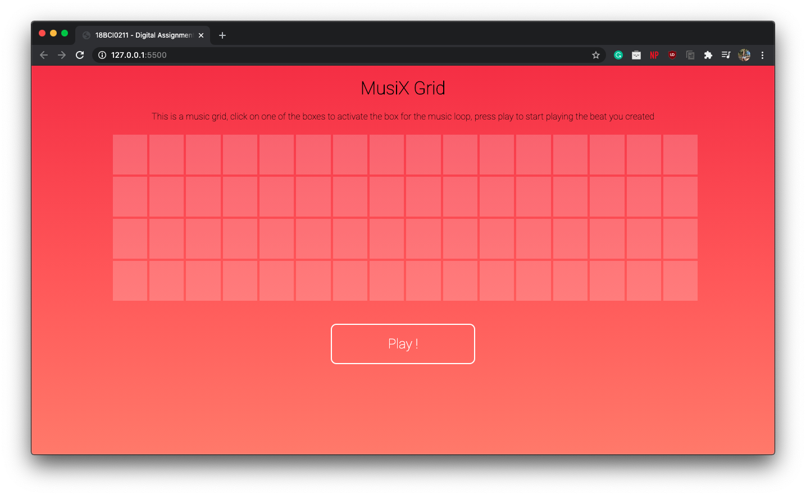

<h1 align="center">
  
</h1>

  
    

  <a href="#key-features">Key Features</a> • <a href="#Demo">Demo</a> • <a href="#Screenshots">Screenshots</a>

This was made for an University Assignment in which we had to make an interactive Javascript Game. Unfortunately i didn't use git initially since i believed it'd be a small project and thus the code dump instead of proper commits like in the other repos.

## Key Features
<a name="key-features">

* Uses [Tone.js](https://github.com/Tonejs/Tone.js)
* Built using Pure Javacript, HTML and CSS no other frameworks used!
* Generate Beats using browser with a few clicks

## Demo
<a href="https://darshkpatel.github.io/MusiX-Grid"><h2>Checkout the live demo here</h2></a>

## Screenshots

